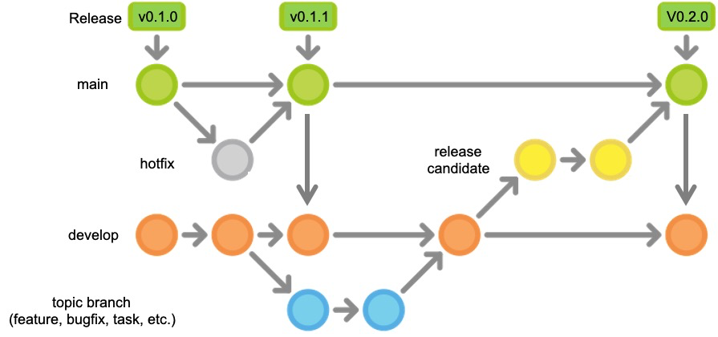

.. ##
.. ## Copyright (c) 2016-21, Lawrence Livermore National Security, LLC
.. ## and RAJA project contributors. See the RAJA/COPYRIGHT file
.. ## for details.
.. ##
.. ## SPDX-License-Identifier: (BSD-3-Clause)
.. ##

.. _branching-label:

*******************************************
RAJA Branch Development
*******************************************

========================
Gitflow Branching Model
========================

The RAJA project uses a simple branch development model based on 
`Gitflow https://datasift.github.io/gitflow/IntroducingGitFlow.html>`_.
Gitflow is a branching model centered around software releases. It is a simple
workflow that makes clear which branches correspond to which phases of
development and those phases are represented explicitly in the branch names and
structure of the repository. As in other branching models, developers develop 
code on a local branch and push their work to a central repository.

---------------------------------
Persistent, Protected Branches
---------------------------------

The **main** and **develop** branches are the two primary branches we use.
They always exist and the distinction between them is central to Gitflow.

  * Merges into the *main* branch record the official release history of the 
    project. Each time the main branch is changed, it is tagged with a new 
    version number. For a description of the **semantic versioning** scheme
    we use, please see :ref:`semver-label`.

  * The *develop* branch is used to integrate and test new features and most
    bug fixes before they are merged into main for a relase.

All other branches in the RAJA repo are temporary and are used to perform 
specific development tasks. When those tasks are complete, the corresponding
branch is deleted.

.. important:: **Development never occurs directly on the main branch or 
               develop branch.**

----------------
Feature Branches
----------------

*Feature* branches are created off of other branches (usually develop) and are 
used to develop new features, bug fixes, etc. before they are merged to develop
and eventually main. *Feature branches are temporary*, living only as long as 
they are needed to complete development tasks they contain.

Each new feature, or other well-defined portion of work, is developed on its
own feature branch. We typically include a label, such as  "feature" or 
"bugfix", in a feature branch name to make it clear what type of work is being 
done on the branch. For example, **feature/<name-of-feature>** for a new 
feature, **bugfix/<issue>** for a bugfix, etc.

.. important:: When doing development on a feature branch, it is good practice
               to regularly push your changes to the central RAJA repository 
               as a backup mechanism. Also, regularly merge the develop branch 
               into your feature branch so that it does not diverge too much 
               from other development on the project. This will help reduce 
               merge conflicts that you must resolve when your work is ready 
               to be merged into the develop branch.

When a portion of development is complete and ready to be merged into the
develop branch, submit a *pull request* for review by other team members. 
When all issues, suggestions, etc. arising in review discussion have been 
addressed, reviewers have approved them, and all continuous integration checks 
have passed, the pull request can merged into the develop branch.

.. important:: **Feature branches never interact directly with the main
               branch.**

---------------------------
Other Important Branches
---------------------------

**Release candidate** and **hotfix** branches are two other important 
temporary branch types in Gitflow. They will be explained in the
:ref:`release-label` section.

----------------------
Gitflow Illustrated
----------------------

The figure below shows the basics of how branches interact in Gitflow.

   This figure shows typical interactions between key branches in the Gitflow
   workflow. Here, development starts after the v0.1.0 release. Then, 
   a bug was found that needed to be made available to users.
   A *hotfix* branch was made off of main and merged back to main after the
   issue was fixed. Release v0.1.1 was tagged and main was merged into 
   develop. Work started on a topic/feature branch before the v0.1.1 releases
   and was merged into develop after the v0.1.1 release. Then, a release 
   candidate branch was made from develop. Some release finalization changes
   were made on it, it was merged into main, and the v0.2.0 release was tagged.
   Finally, main was merged into develop so the changes made for the release
   would be integrated into subsequent development.
