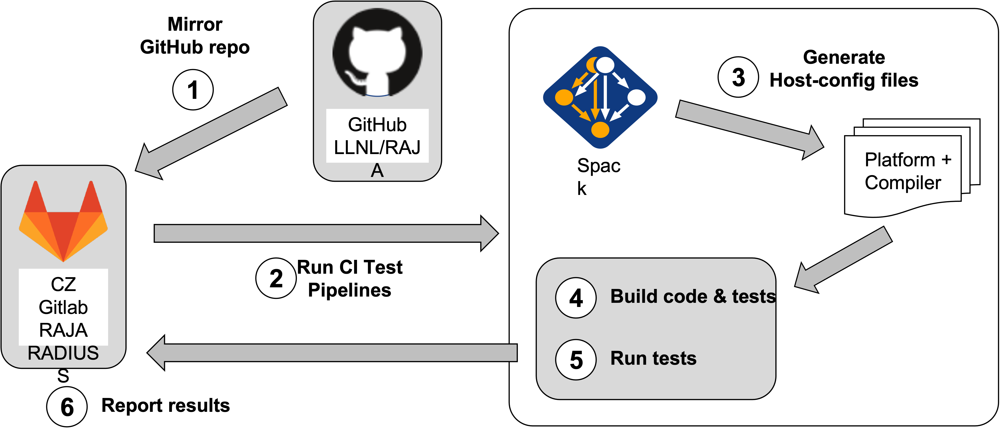
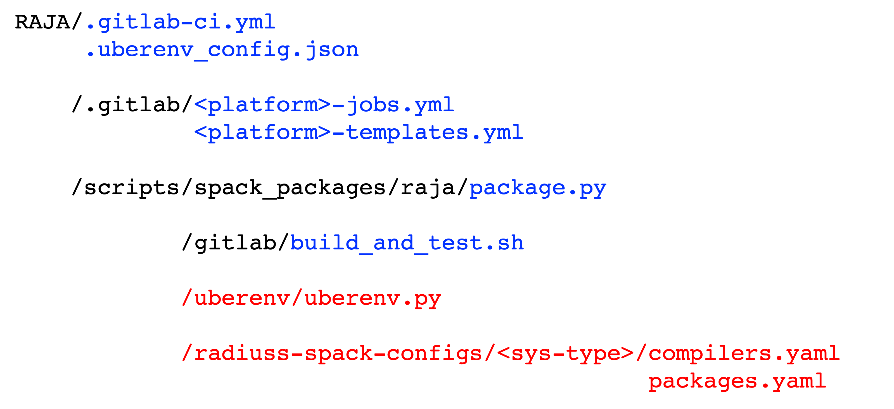

.. ##
.. ## Copyright (c) 2016-24, Lawrence Livermore National Security, LLC
.. ## and RAJA project contributors. See the RAJA/LICENSE file
.. ## for details.
.. ##
.. ## SPDX-License-Identifier: (BSD-3-Clause)
.. ##

.. _ci-label:

************************************
Continuous Integration (CI) Testing
************************************

.. important:: * All CI checks must pass before a pull request can be merged.
               * The status (running and pass/fail) for all checks can be 
                 viewed by clicking the appropriate link in the **checks** 
                 section of a GitHub pull request.

The RAJA project uses threes CI tools to run tests:

  * **Azure Pipelines** and **GitHub Actions** runs builds and tests for Linux,
    Windows, and MacOS environments using compilers in container images 
    maintained in the `RADIUSS Docker Project <https://github.com/LLNL/radiuss-docker>`_.
    While we do some GPU builds on Azure and GitHub Actions for CUDA, HIP, and
    SYCL, RAJA tests are only run for CPU-only builds. The current set of 
    builds run on Azure and GitHub Actions can be seen by looking at the 
    ``RAJA/azure-pipelines.yml`` and ``RAJA/.github/workflows/build.yml`` files,
    respectively. The ``RAJA/Dockerfile`` file contains the CMake options used
    to generate the build environment for each of the builds.

  * **GitLab** instance in the Collaboration Zone (CZ) of the Livermore 
    Computing (LC) Center runs builds and tests on LC platforms using
    software stacks (compilers, etc.) important to many RAJA user applications.
    GitLab build configurations are more complex than Azure; they will be 
    described in detail in :ref:`gitlab_ci-label`. 

These tools integrate with the RAJA GitHub project and automatically run RAJA 
builds and tests when a PR is created and when changes are pushed to a PR 
branch or one of our protected branches `main` and `develop`.

The following sections describe basic elements of the operation of the CI tools.

.. _gitlab_ci-label:

=========
GitLab CI
=========

The GitLab CI instance used by the RAJA project lives in the Livermore 
Computing (LC) Collaboration Zone (CZ). It runs builds and tests using 
machine and compiler environments important to RAJA user applications at LLNL.

Constraints
-----------

LC security policies constrain how projects can run GitLab CI on LC platforms.
Specifically, policies require that all members of a GitHub project be members 
of the LLNL GitHub organization and have two-factor authentication 
enabled on their GitHub accounts. When these requirements are satisfied, 
GitLab on the LC CZ can mirror a GitHub project and trigger GitLab CI when
changes are made to the GitHub repo. If the requirements are not met, LC 
GitLab CI checks will not run. This implies, for example, that GitLab CI will 
not run an LLNL organization project for a PR made from a fork of the project 
repo by someone not in the LLNL organization. 

For a compliant LLNL GitHub project like RAJA, auto-mirroring of the 
GitHub repo to LC GitLab is done every 30 minutes or so, triggering builds and
tests on new changes pushed to the RAJA GitHub project. If you have access to 
LC platforms, you can learn more about `LC GitLab mirroring <https://lc.llnl.gov/confluence/pages/viewpage.action?pageId=662832265>`_.

.. important:: **GitLab CI will not run for a PR branch on a fork of the RAJA 
               repo.** The RAJA project manually manages contributions made 
               on forks of the RAJA repo using the procedure described in 
               :ref:`contributing-label`.

.. _gitlab_ci_workflow-label:

GitLab CI (LC) Testing Workflow
--------------------------------------

The figure below shows the sequence of steps in the RAJA GitLab CI testing 
process. More details about these steps will appear in the in later sections:

  #. A *mirror* of the RAJA GitHub repo is updated in the RAJA LC CZ GitLab 
     project automatically (approximately every 30 minutes).

     .. note:: There may be a delay in the mirroring, since it is not 
               synchronous with changes to the RAJA GitHub project.

  #. GitLab launches CI test pipelines for any new changes made to the 
     ``develop`` or ``main`` branches or any non-fork PR branch. While 
     running, the execution and pass/fail status may be viewed and monitored 
     in the GitLab CI GUI or in the RAJA GitHub project checks section of a PR.

  #. For each platform and compiler combination,
     `Spack <https://github.com/spack/spack>`_ builds RAJA dependencies and
     generates a configuration in the form of a CMake cache file, or 
     *host-config* file.

  #. A host-config file is passed to CMake, which configures a RAJA build 
     space.  Then, RAJA and its tests are compiled.

  #. Next, the RAJA tests are run.

  #. When test pipelines complete, results are reported to GitLab.

  #. Lastly, GitLab reports to GitHub indicating the status of checks there.

   The main steps in the RAJA GitLab CI testing workflow are shown in the 
   figure. This process is triggered when a developer makes a PR on the 
   GitHub project or whenever changes are pushed to the source branch of a PR.

Next, we describe the roles that external projects and files in the RAJA repo 
play in the RAJA GitLab CI workflow.

.. _gitlab_ci_depend-label:

GitLab CI Testing Dependencies (specific to LC CZ)
---------------------------------------------------

RAJA GitLab CI testing depends on several other projects that we develop
collaboratively with other projects. These include

  * `RADIUSS Shared CI <https://github.com/LLNL/radiuss-shared-ci>`_,
    a centralized framework for software testing with GitLab CI on LC
    machines. The project is developed on GitHub and is mirrored to the LC 
    CZ GitLab instance.
  * `Spack <https://github.com/spack/spack>`_, a multi-platform package 
    manager that builds and installs HPC software stacks.
  * `Uberenv <https://github.com/LLNL/uberenv>`_, a Python script
    that helps to simplify the workflow of Spack and other tools for building 
    third-party dependencies. Uberenv is a submodule in RAJA that lives in
    ``RAJA/scripts/uberenv/``.
  * `RADIUSS Spack Configs <https://github.com/LLNL/radiuss-spack-configs>`_, a
    collection of Spack compiler and package configurations used by Spack to
    generate build configurations. The build configurations are specific to
    LLNL LC platforms. Spack packages for multiple projects are maintained in
    this project. Shared RADIUSS CI jobs are also hosted by this project as
    they relate to the Spack configuration. RADIUSS Spack Configs is a
    submodule in RAJA that lives in ``RAJA/scripts/radiuss-spack-configs/``.

The relationships among these dependencies in a project that uses them is 
described in the `RADIUSS Shared CI User Guide <https://radiuss-shared-ci.readthedocs.io/en/woptim-isolate-jobs/sphinx/user_guide/how_to.html#leverage-spack>`_ along with information about
how the framework works and how to set up a project to use it.

.. important:: The RAJA Spack package is maintained in the `RADIUSS Spack
   Configs <https://github.com/LLNL/radiuss-spack-configs>`_ project. After
   packages are updated there, they are pushed to the Spack repo on GitHub via
   a pull request.

The remainder of this section describes files in the RAJA repo that are
used to configure and customize the shared CI framework specifically for the 
RAJA project.

.. _gitlab_ci_files-label:

GitLab CI Testing Files (specific to LC CZ)
--------------------------------------------

The following figure shows directories and files in the RAJA project that 
support LC GitLab CI testing. 

   The figure shows directories and files in the RAJA repo that support GitLab
   CI testing. Files in blue are specific to the CI while those in red relates
   to the build (Spack) environment description. The ``build_and_test.sh``
   scripts stands at the interface between CI and Spack. ``uberenv`` and
   ``radiuss-spack-configs`` are both Git submodules that are shared and
   maintained with other projects.

Briefly, these files play the following roles in GitLab CI testing:

  * The `RAJA/.gitlab-ci.yml
    <https://github.com/LLNL/RAJA/tree/develop/.gitlab-ci.yml>`_ file is the
    top-level file for GitLab CI configuration. It defines variables used
    throughout the CI configuration such as GitHub project name and
    organization, service user account name, version information for RADIUSS
    Shared CI project we are using, and top-level information for triggering
    build-and-test sub-pipelines.
  * The `RAJA/.uberenv_config.json
    <https://github.com/LLNL/RAJA/tree/develop/.uberenv_config.json>`_ file
    defines information about Spack such as Spack version we are using,
    location of Spack packages, etc.
  * The `RAJA/.gitlab <https://github.com/LLNL/RAJA/tree/develop/.gitlab>`_
    directory contains several files that connect RAJA GitLab pipelines to
    shared pipelines defined in the `RADIUSS Shared CI
    <https://github.com/LLNL/radiuss-shared-ci>`_ project, as well as
    RAJA-specific jobs and global job customizations that we use, such as job
    time limits, etc. These files are modified from templates provided by the
    RADIUSS Shared CI project.
  * In particular, `RAJA/.gitlab/jobs
    <https://github.com/LLNL/RAJA/tree/develop/.gitlab/jobs>`_ directory
    contains the files defining RAJA specific jobs per machine. This file is
    appended to the list of shared CI jobs provided by `RADIUSS Spack Configs
    <https://github.com/LLNL/radiuss-spack-configs>`_. Each job ultimately consists
    in one Spack spec.
  * The `RAJA/scripts/gitlab/build_and_test.sh
    <https://github.com/LLNL/RAJA/tree/develop/scripts/gitlab/build_and_test.sh>`_
    contains commands that are run during the RAJA build and test process. It is
    set in the CI using the ``JOB_CMD`` variable.

In the following sections, we discuss how these files are used in the 
steps of the RAJA GitLab CI testing process summarized above.

.. _gitlab_ci_pipelines-label:

Launching CI pipelines (step 2) 
^^^^^^^^^^^^^^^^^^^^^^^^^^^^^^^^

In **step 2** of the diagram above, GitLab launches RAJA test pipelines 
starting with the content of the ``RAJA/.gitlab-ci.yml`` file described above.
Most importantly, this file identifies the location of two files 
`RAJA/.gitlab/subscribed-pipelines.yml <https://github.com/LLNL/RAJA/tree/develop/.gitlab/subscribed-pipelines.yml>`_ and
`RAJA/.gitlab/custom-jobs-and-variables.yml <https://github.com/LLNL/RAJA/tree/develop/.gitlab/custom-jobs-and-variables.yml>`_.
The ``subscribed-pipelines.yml`` file connects the RAJA GitLab environment to 
the platform and pipelines defined in the RADIUSS Shared CI project.
The ``custom-jobs-and-variables.yml`` file defines how resources are 
allocated to run test jobs on various LC platforms and common build 
configuration variants for those platforms

Each job that is run is defined by a Spack spec in one of two places, depending
on whether it is *shared* with other projects or it is specific to RAJA. The
shared jobs are defined in files located in
``gitlab/radiuss-jobs/<MACHINE>.yml`` in the `RADIUSS Spack Configs Project
<https://github.com/LLNL/radiuss-spack-configs>`_.  Overrides (modifications)
of those jobs and other RAJA-specific jobs are defined in
``RAJA/.gitlab/jobs/<MACHINE>.yml`` files.

**Each shared job will be run as-is unless it is overridden** in the RAJA local
jobs file for the corresponding machine. For example, a shared job for the LC
ruby machine may appear in the RADIUSS Spack Configs file 
``gitlab/radiuss-jobs/ruby.yml`` as::

  gcc_8_1_0:
    variables:
      SPEC: "${PROJECT_RUBY_VARIANTS} %gcc@8.1.0 ${PROJECT_RUBY_DEPS}"
    extends: .job_on_ruby

and then may be overridden in the ``RAJA/.gitlab/jobs/ruby.yml``
file as::

  gcc_8_1_0:
    variables:
      SPEC: " ${PROJECT_RUBY_VARIANTS} %gcc@8.1.0 ${PROJECT_RUBY_DEPS}"
      RUBY_JOB_ALLOC: "--time=60 --nodes=1"
    extends: .job_on_ruby

In this example, the Spack build spec is the same, but the job is configured
with a specific timeout limit and number of nodes appropriate for RAJA testing.

.. important:: A shared job override **must use the same job label as the
   shared job** defined in the RADIUSS Shared CI project.

RAJA-specific jobs whose configurations are not shared with other projects are
also defined in the ``RAJA/.gitlab/jobs/<MACHINE>.yml`` files.  For example::

  clang_10_0_1_gcc_8_3_1_desul_atomics:
    variables:
      SPEC: " ~shared +openmp +tests +desul %clang@10.0.1 cxxflags=--gcc-toolchain=/usr/tce/packages/gcc/gcc-8.3.1 cflags=--gcc-toolchain=/usr/tce/packages/gcc/gcc-8.3.1"
    extends: .job_on_ruby

defines a RAJA job with desul atomics enabled to be run on the ruby machine.

.. important:: Each base compiler configuration that is used in GitLab CI
   testing must have a Spack spec defined for it in the appropriate file for
   the machine that it will be tested on in the `RADIUSS Spack Configs
   <https://github.com/LLNL/radiuss-spack-configs>`_ project.

.. _gitlab_ci_running-label:

Running a CI build and test pipeline  (steps 3, 4, 5, 6)
^^^^^^^^^^^^^^^^^^^^^^^^^^^^^^^^^^^^^^^^^^^^^^^^^^^^^^^^^

The `RAJA/scripts/gitlab/build_and_test.sh <https://github.com/LLNL/RAJA/tree/develop/scripts/gitlab/build_and_test.sh>`_ file defines the steps executed
for each build and test pipeline as well as information that will appear in the
log output for each step. The script "echoes" information to the test logs 
indicating what it is doing. Following the echo commands in the file may help
one understand the workflow.

The details of the various steps in the process may change from time to time.
However, the basic sequence is:

  #. Perform some basic (platform-independent) setup.
  #. Invoke the ``RAJA/scripts/uberenv/uberenv.py`` Python script that drives 
     Spack to generate a host-config file from a given spec **(step 3)**.
  #. Run CMake to configure a build space passing the host-config file to it
     which contains all CMake variable settings for the configuration.
  #. Build RAJA and tests **(step 4)**.
  #. Run RAJA tests via ctest **(step 5)**.
  #. Export XML test reports for reporting in GitLab **(step 6)**, which is 
     done by the RADIUSS Shared CI Framework.
  #. Perform clean up tasks.

Recall that RAJA project specific settings defining the Spack version to use, 
locations of Spack packages, etc. are located in the 
`RAJA/.uberenv_config.json <https://github.com/LLNL/RAJA/tree/develop/.uberenv_config.json>`_ file.

Also, recall that to generate a host-config file, Spack uses packages and 
specs in the `RADIUSS Spack Configs project <https://github.com/LLNL/radiuss-spack-configs>`_ (a RAJA submodule), 
plus RAJA-specific specs defined in files in the `RAJA/.gitlab/jobs <https://github.com/LLNL/RAJA/tree/develop/.gitlab/jobs>`_ directory, as described earlier.

.. _azure_ci-label:

======================================
Azure Pipelines and GitHub Actions CI
======================================

We use Azure Pipelines and GitHub Actions to run builds and tests for Linux, 
Windows, and MacOS environments. We use these tools to run Linux builds and
tests for various less-common configurations, such as compiler versions that are
not available on LC systems. While we do builds for CUDA, HIP, and SYCL RAJA 
GPU back-ends in the Azure and GitHub Actions Linux environments, RAJA tests 
are only run for CPU-only pipelines.

.. note:: Azure Pipelines and GitHub Actions CI test jobs are run on every
   RAJA pull request, regardless of whether it was made from a branch in the
   RAJA project repo or from a fork of the repo.

Azure Pipelines Testing Workflow
--------------------------------

The jobs run in the Azure Pipelines testing workflow for RAJA are specified in
the `RAJA/azure-pipelines.yml <https://github.com/LLNL/RAJA/blob/develop/azure-pipelines.yml>`_ file. This file defines the job steps, commands,
compilers, etc. for each OS environment in the associated ``- job:`` section.
A summary of the configurations we build are:

  * **Windows.** The ``- job: Windows`` Windows section contains information
    for the Windows test builds. For example, we build and test RAJA as
    a static and/or shared library. This is indicated in the Windows 
    ``strategy`` section::

      strategy:
        matrix:
          shared:
            ...
          static:
            ...

    We use the Windows/compiler image provided by the Azure application 
    indicated the ``pool`` section; for example::

      pool:
        vmImage: 'windows-2019'

    **MacOS.** The ``- job: Mac`` section contains information for Mac test 
    builds. For example, we build RAJA using the MacOS/compiler 
    image provided by the Azure application indicated in the ``pool`` section; 
    for example::

      pool:
        vmImage: 'macOS-latest' 

    **Linux.** The ``- job: Docker`` section contains information for Linux
    test builds. We build and test RAJA using Docker container images generated 
    with recent versions of various compilers. The RAJA project shares these 
    images with other open-source LLNL RADIUSS projects and they are maintained
    in the `RADIUSS Docker <https://github.com/LLNL/radiuss-docker>`_ 
    project on GitHub. The builds we do at any point in time are located in 
    the ``strategy`` block::

      strategy:
        matrix: 
          gcc11:
            docker_target: ...
          ...
          clang14:
            docker_target: ...
          ...

    The Linux OS image used is indicated in the ``pool`` section; 
    for example::

      pool:
        vmImage: 'ubuntu-latest'

GitHub Actions Testing Workflow
--------------------------------

The jobs run in the GitHub Actions testing workflow for RAJA are specified in
the `RAJA/.github/workflows/build.yml <https://github.com/LLNL/RAJA/blob/develop/.github/workflows/build.yml>`_ file. This file defines the job steps, commands,
compilers, etc. for each OS environment in the associated ``jobs:`` section.
A summary of the configurations we build are:

  * **Windows.** The ``build_windows:`` Windows section contains information
    for the Windows test builds. For example, we build and test RAJA as
    a static and shared library. This is indicated in the Windows ``strategy``
    section::

      strategy:
        matrix:
          shared:
          - args: 
            BUILD_SHARED_LIBS=On 
            CMAKE_WINDOWS_EXPORT_ALL_SYMBOLS=On
        - args: BUILD_SHARED_LIBS=Off

    We use the Windows/compiler image provided by the GitHub Actions application
    indicated by::

      runs-on: windows-latest

    **MacOS.** The ``build_mac:`` section contains information for Mac test
    builds. We use the MacOS/compiler image provided by the GitHub Actions 
    application indicated by::

      runs-on: macos-latest

    **Linux.** The ``build_docker:`` section contains information for Linux
    test builds. We build and test RAJA using Docker container images
    maintained in the `RADIUSS Docker <https://github.com/LLNL/radiuss-docker>`_
    project on GitHub. The builds we do at any point in time are located in
    the ``strategy`` block, for example::

      strategy:
      matrix:
        target: [gcc12_debug, gcc13, clang13, clang15, rocm5.6, rocm5.6_desul, intel2024, intel2024_debug, intel2024_sycl]
     
    The Linux OS image used is indicated by::
   
      runs-on: ubuntu-latest 

Docker Builds
-------------

For each Linux/Docker pipeline, the base container images, CMake, build, and
test commands are located in `RAJA/Dockerfile <https://github.com/LLNL/RAJA/blob/develop/Dockerfile>`_.

The base container images are built and maintained in the 
`RADIUSS Docker <https://github.com/LLNL/radiuss-docker>`_ project.
These images are rebuilt regularly ensuring that we have the most up to date
builds of each container and compiler.

.. note:: Please see :ref:`docker_local-label` for more information about
          reproducing Docker builds locally for debugging purposes.

