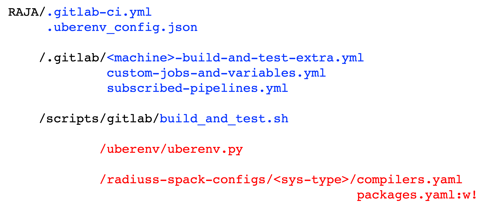

.. ##
.. ## Copyright (c) 2016-22, Lawrence Livermore National Security, LLC
.. ## and RAJA project contributors. See the RAJA/LICENSE file
.. ## for details.
.. ##
.. ## SPDX-License-Identifier: (BSD-3-Clause)
.. ##

.. _ci-label:

************************************
Continuous Integration (CI) Testing
************************************

The RAJA project employs multiple tools to run tests for each GitHub
*pull request*, all of which must pass before the pull request will be merged.
These tools include:

  * **Azure.** This runs builds for Linux, Windows, and MacOS  environments 
    using a variety of compilers. While we do GPU builds for CUDA, HIP, and
    SYCL on Azure, RAJA tests are run for each non-GPU build.

  * **Gitlab CI.** This runs builds and tests on platforms in the Livermore
    Computing *(Collaboration Zone)* (LC CZ).

These tools integrate seamlessly with GitHub, for the most part. They 
automatically (re)run RAJA builds and tests as changes are pushed to each 
PR branch. Gitlab CI execution on Livermore Computing resources has 
restrictions that are described below.

.. note:: The status of checks (pass/fail, running status) for each of these 
          tools can be viewed by clicking the appropriate link in the **checks**
          section of a pull request.

Gitlab CI
=========

Gitlab CI testing is still being developed to expand compiler and version 
coverage, as well as cross-project testing, such as building and running the
`RAJA Performance Suite <https://github.com/LLNL/RAJAPerf>_` when changes 
are pushed to the RAJA develop branch. 

Constraints
-----------

Running the RAJA Gitlab CI on Livermore Computing (LC) resources is 
constrained by LC security policies. Auto-mirroring of a GitHub project repo
on LC Gitlab requires that all memmbers of the GitHub project are members of 
the LLNL GitHub organization and have two-factor authentication enabled on 
their GitHub accounts. Gitlab CI will run automatically for such projects on 
pull requests that are made by project members. Otherwise, Gitlab CI must be 
run manually by a *blessed* GitHub user satisfying the constraints described 
above.

The folowing sections describe contents of the RAJA repository that support
Gitlab CI testing in the LC CZ, how they fit together to define our
Gitlab testing workflow, and how to perform basic maintenance and development
tasks.

Gitlab CI (LC CZ) Testing and Workflow
--------------------------------------

The following figure illustrates the directories and files in the RAJA 
repo that support Gitlab CI testing in the LC CZ. The file

The following figure illustrates the Gitlab CI testing workflow.

.. figure ./figures/RAJA-Gitlab-Workflow.png

   This figure

.. _vettedspecs-label:

Vetted Specs
------------

The *vetted* compiler specs are those which we use during the RAJA Gitlab CI
testing process. These can be viewed by looking at files in the RAJA
``.gitlab`` directory. For example,

.. code-block:: bash

  $ ls -c1 .gitlab/*jobs.yml
  .gitlab/lassen-jobs.yml
  .gitlab/ruby-jobs.yml

lists the yaml files containing the Gitlab CI jobs for the lassen and ruby 
machines.

Then, executing a command such as:

.. code-block:: bash

  $ git grep -h "SPEC" .gitlab/ruby-jobs.yml | grep "gcc"
      SPEC: "%gcc@4.9.3"
      SPEC: "%gcc@6.1.0"
      SPEC: "%gcc@7.3.0"
      SPEC: "%gcc@8.1.0"

will list the specs vetted on the ruby platform.

More details to come...
