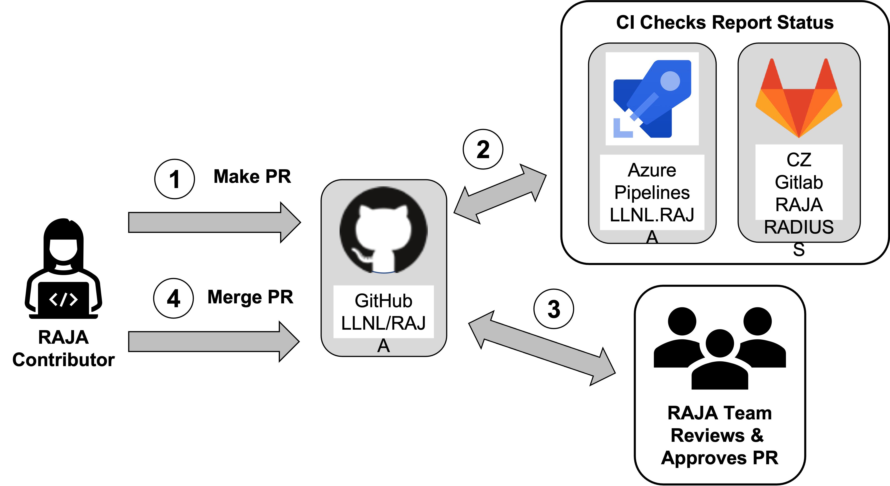

.. ##
.. ## Copyright (c) 2016-24, Lawrence Livermore National Security, LLC
.. ## and RAJA project contributors. See the RAJA/LICENSE file
.. ## for details.
.. ##
.. ## SPDX-License-Identifier: (BSD-3-Clause)
.. ##

.. _contributing-label:

*********************
Contributing to RAJA
*********************

RAJA is a collaborative open-source software project and we encourage 
contributions from anyone who wants to add features or improve its
capabilities. This section describes the following:

  * GitHub project access
  * How to develop a RAJA *pull request* (PR) contribution.
  * Requirements that must be met for a PR to be merged.

We assume contributors are familiar with 
`Git <https://git-scm.com/>`_, which we use for source code version control,
and `GitHub <https://github.com/>`_, which is where our project is hosted. 

.. important:: * Before a PR can be merged into RAJA, all test checks must pass 
                 and the PR must be approved by at least one member of the 
                 core RAJA team.
               * Each RAJA contribution (feature, bugfix, etc.) must include 
                 adequate tests, documentation, and code examples. The 
                 *adequacy* of PR content, in this respect, is determined by
                 PR reviewers applying their professional judgment considering
                 the perspective of RAJA users and developers.

=======================
GitHub Project Access
=======================

RAJA maintains three levels of project access on it GitHub project:

  * **Core team members.** Individuals on the core RAJA team are frequent
    RAJA contributors and participate regularly in project meetings, 
    discussions, and other project activities. They are members of 
    the LLNL GitHub organization and the ``RAJA-core`` GitHub team. Their
    project privileges include the ability to create branches in the repository,
    push code changes to the RAJA repo, make PRs, and merge them when they are 
    approved and all checks have passed. 
  * **Regular contributors.** Individuals, who are not on the core RAJA team, 
    but are members of the LLNL GitHub organization and are involved in some
    aspects of RAJA development are considered regular contributors. They are
    members of the ``RAJA-contrib`` GitHub team. Their project privileges 
    include the ability to create branches in the repository, push code changes
    to the RAJA repo, and make PRs. However, they may not merge PRs and must 
    coordinate with the core team to have their work included in the develop
    branch. This is mainly due to the way GitHub structures its project 
    access levels.
  * **Everyone else.** Anyone with a GitHub account is welcome to contribute
    to RAJA. Individuals outside of the two groups described above can make PRs
    in the RAJA project, but must do so from a branch on a *fork* of 
    the RAJA repo. This is described below.

=======================
Pull Request Process
=======================

The following figure shows the basic elements of the RAJA PR contribution 
workflow. Some details vary depending on RAJA GitHub project access level 
of the contributor. The process involves four main steps:

  #. A RAJA contributor makes a PR on the RAJA GitHub project to merge a
     branch on which she has developed a contribution into another RAJA branch,
     typically, the develop branch.
  #. When a PR is created, GitHub triggers Azure and GitHub Actions CI test
     checks and GitLab CI checks if the branch is part of the RAJA GitHub repo. 
     Running and pass/fail status for all checks is reported back to the 
     corresponding GitHub pull request where it can be viewed and monitored.
  #. Meanwhile, RAJA team members and other contributors review the PR, 
     suggesting changes and/or approving when they think it is ready to merge.
  #. When all checks pass and the PR is approved, the PR may be merged.

   The four main steps in the RAJA pull request (PR) process, which are
   common practices for many software projects.

This PR process should be familiar to nearly everyone who contributes to
s software project. If you would like more information about pull requests, 
GitHub has a good 
`PR guide <https://help.github.com/articles/about-pull-requests/>`_ 
on PR basics.

.. important:: When you create a RAJA PR, you should enter a description of 
               its contents in the *PR template* form the team maintains for 
               this purpose. A good PR summary includes a descriptive title 
               of the the bug you fixed or the feature you have added. Other 
               relevant details that will assist others in reviewing your 
               contribution should also be included.

============
Forking RAJA
============

As noted earlier, if you are not a member of the core RAJA development team, 
or a recognized RAJA contributor, then you do not have permission to create a 
branch in the RAJA GitHub repository. This choice is due to policies enforced 
by the LLNL organization on GitHub (in which the RAJA project resides) and the
Livermore Computing (LC) organization (in which we run our GitLab CI testing).
Fortunately, you may still contribute to RAJA by `forking the RAJA repo 
<https://github.com/LLNL/RAJA/fork>`_. Forking creates a copy of the RAJA 
repository that you own. You can make changes on your local copy and push them 
your fork on GitHub. When you are ready to have your RAJA contribution reviewed
ad added to the RAJA project, you may create a pull request in the RAJA project.

.. note:: A contributor who is not a member of the core RAJA development team,
          or a recognized RAJA contributor, cannot create a branch in the RAJA 
          GitHub repo. However, anyone can create a fork of the 
          RAJA project and create a pull request based on the fork in the 
          RAJA project.

===============================
Developing A RAJA Contribution
===============================

New features, bugfixes, and other changes are developed on a **feature branch.**
Each such branch should be based on the most current RAJA ``develop`` branch. 
For more information on the branch development model used in RAJA, please see
:ref:`branching-label`. When you want to make a contribution, first ensure 
you have a local, up-to-date copy of the ``develop`` branch by running the
following commands:

.. code-block:: bash

    $ git checkout develop
    $ git pull origin develop
    $ git submodule update --init --recursive

Then, in your local copy, you will be on the current version of develop branch
with all RAJA submodules synchronized with that. 

-----------------------------------
Feature and Bugfix Contributions
-----------------------------------

Assuming you are on an up-to-date develop branch in your local copy of RAJA,
the first step toward developing a RAJA contribution is to create a new branch 
on which to do your development and push it to the remote origin of your local 
copy.  For example:

.. code-block:: bash

    $ git checkout -b <username>/feature/<name-of-feature>
    $ git push <remote> <branch-name> 

where ``<username>/feature/<name-of-feature>`` is the name of your feature
branch. Or,

.. code-block:: bash

    $ git checkout -b <username>/bugfix/<issue-fixed>
    $ git push <remote> <branch-name>

where ``<username>/bugfix/<issue-fixed>`` is the name of your bugfix branch.

Proceed to modify your branch by committing changes with reasonably-sized 
work portions (i.e., *atomic commits*), and add tests that will exercise your 
new code, and examples and documentation, as needed. If you are creating new 
functionality, please add documentation to the appropriate section of the 
`RAJA Documentation <https://readthedocs.org/projects/raja/>`_. The source 
files for the RAJA documentation are maintained in the ``RAJA/docs`` directory 
of the source repository. Consider adding example code(s) that illustrate 
usage of the new features you develop to help users and other developers 
understand your addition. These should be placed in the ``RAJA/examples`` 
directory and referenced in the RAJA User Guide as appropriate.

After your work is complete, you've tested it, and developed appropriate
documentation, you can push your local branch to GitHub and create a PR in the 
RAJA project to merge your work into the RAJA develop branch. It will be 
reviewed by members of the RAJA team, who will provide comments, suggestions, 
etc. 

As we stated earlier, not all required :ref:`ci-label` checks can be run on a 
PR made from a branch in a fork of RAJA. When the RAJA team has agreed to 
accept your work, it will be pulled into the RAJA GitHub repo 
(see :ref:`prfromfork-label`). Then, it will run through all required testing 
and receive final reviews and approvals. When it is approved and all CI test 
checks pass, your contribution will be merged into the RAJA repository, most 
likely the develop branch.

.. important:: When creating a branch that you intend to be merged into the 
               RAJA repo, please give it a succinct name that clearly describes 
               the contribution.  For example, 
               **username/feature/<name-of-feature>** for a new feature, 
               **username/bugfix/<issue-fixed>** for a bugfix, etc.

-----------------------------------
Style
-----------------------------------
RAJA enforces style within the ``src`` and ``include`` directories using clang-format,
major version 14.  Formatting will be enforced on pull requests through CI, and it
is up to the contributor to guarantee that their code is in compliance with the
clang-format settings specified within ``.clang-format``.  To make this easy,
RAJA has provided two options for applying clang-format:

* The CMake build target ``style``

  *  If a ``clang-format`` executable with major version 14 is available in the ``PATH``
     when running CMake, RAJA's build system should find that executable and set 
     the CMake variable ``CLANGFORMAT_EXECUTABLE`` to that executable's path.  
  *  If an invalid version exists in the ``PATH``, or no ``clang-format`` version is 
     specified in the path, the ``CLANGFORMAT_EXECUTABLE`` variable must be set by the 
     user in order to properly configure the make `style` target.  This can be done by 
     passing ``-DCLANGFORMAT_EXECUTABLE=<path to clang-format 14>`` to ``cmake`` during 
     build configuration.
  *  If an invalid version of ``clang-format`` is supplied, the following error will be 
     emitted at build config time:

    .. code-block:: bash

      blt_add_clangformat_target: clang-format '14' is required, found <incorrect version>.
        Disabling 'style' build target.  

  *  If no ``CLANGFORMAT_EXECUTABLE`` is supplied, ``cmake`` will print the warning 
     ``Failed to locate CMakeFormat executable``.
        
* Git hooks

  * Follow these steps to setup githooks, from the root directory of RAJA

    .. code-block:: bash

     # Only necessary if clang-format 14 is not in the $PATH variable.  
     # This line can also be placed in .zshrc
     $ export RAJA_CLANG_FORMAT=<path to clang-format install>
     $ scripts/setup-hooks.sh

  * The ``scripts/setup-hooks.sh`` script will install a ``pre-commit`` git hook 
    script that applies clang-format to any changes staged with git.  If a ``clang-format``
    executable with major version 14 is available in the ``PATH``, this executable will be used.
    If not, the user must set the environment variable ``RAJA_CLANG_FORMAT`` to a valid 
    clang-format executable.  If the script cannot find a valid clang-format installation
    from either the ``PATH`` or from the environment variable ``RAJA_CLANG_FORMAT``, the 
    script will print a warning and exit, allowing the commit to continue.

.. _prfromfork-label:

===========================================================
Accepting A Pull Request From A Forked Repository
===========================================================

Due to LLNL security policies, some RAJA pull requests will not be able to
be run through all RAJA CI tools. The Livermore Computing (LC) Center
GitLab systems restrict which GitHub PRs may automatically run through its 
CI test pipelines. For example, a PR made from branch on a forked repository 
will not trigger GitLab CI checks. GitLab CI on LC platforms will be run only
on PRs that are made from branches in the GitHub RAJA repository. 
See :ref:`ci-label` for more information about RAJA PR testing.

.. note:: **The following process for accepting PR contributions from a fork 
          of the RAJA repo must be executed by a member of the RAJA team:**

          To facilitate testing contributions in PRs from forked repositories, 
          we maintain a script to pull a PR branch from a forked repo into the 
          RAJA repo. First, identify the number of the PR, which appears at
          the top of your PR. Then, run a script from the top-level RAJA 
          directory::

            $ ./scripts/make_local_branch_from_fork_pr -b <PR #>

          If successful, this will create a branch in your local copy of the
          RAJA repo labeled ``pr-from-fork/<PR #>`` and you will be on that
          local branch in your checkout space. To verify this, you can run
          the following command after you run the script::

            $ git branch

          You will see the new branch in the listing of branches and the branch
          you are on will be starred.

          You can push the new branch to the RAJA repo on GitHub::

            $ git push git@github.com:LLNL/RAJA.git <branch-name>

          and make a PR for the new branch. It is good practice to reference 
          the original PR in the description of the new PR to track the 
          original PR discussion and reviews.

          All CI checks will be triggered to run on the new PR made in the
          RAJA repo. When everything passes and the PR is approved, it may 
          be merged. When it is merged, the original PR from the forked repo 
          will be closed and marked as merged unless it is referenced 
          elsewhere, such as in a GitHub issue. If this is the case, then the 
          original PR (from the forked repo) must be closed manually.

