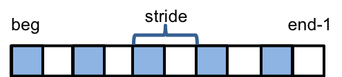

.. ##
.. ## Copyright (c) 2016-18, Lawrence Livermore National Security, LLC.
.. ##
.. ## Produced at the Lawrence Livermore National Laboratory
.. ##
.. ## LLNL-CODE-689114
.. ##
.. ## All rights reserved.
.. ##
.. ## This file is part of RAJA.
.. ##
.. ## For details about use and distribution, please read RAJA/LICENSE.
.. ##

.. _index-label:

================================
Indices, Segments, and IndexSets
================================

Loop variables and their associated iteration spaces are fundamental to 
loop kernels with RAJA. RAJA provides iteration space types that serve as
flexible building blocks that can be used to form a variety of loop iteration
patterns. For example, these types can be used to aggregate, partition,
(re)order, etc. loop iterates. Here, we introduce RAJA index and iteration 
space concepts and types.

.. note:: All types described here are located in the RAJA namespace.

-------
Indices
-------

Just like traditional C and C++ for-loops, RAJA uses index variables to 
identify loop iterates; e.g., a lambda expression loop body takes an index
variable argument. RAJA containers and methods are templated in
a sufficiently general way to allow users to use any integral type for an
index variable. In most cases, the index variable type is explicitly specified
by users. However, RAJA also provides a ``RAJA::Index_type`` type, which is 
used as a default in some circumstances for convenience (i.e., users can
use an alias to a typed construct without specifying the type). The
``RAJA::Index_type`` type is an alias to the C++ type 'std::ptrdiff_', which 
is appropriate for most compilers to generate various loop-level optimizations.

Users can change the type of ``RAJA::Index_type`` by editing the RAJA
``types.hpp`` header file.

-------------
Segments
-------------

A RAJA 'Segment' is a container of loop iterates that one wants to 
execute as a unit. RAJA provides a few important Segment types for
contiguous index ranges, strided ranges, and arbitrary lists of indices.

Stride-1 Segments
^^^^^^^^^^^^^^^^^^^

A ``RAJA::TypedRangeSegment`` is the fundamental type for representing a 
stride-1 (i.e., contiguous) range of indices (figure below).

.. figure:: ../figures/RangeSegment.png

   A range segment defines a stride-1 index range [beg, end).

One can create an explicitly-typed range segment or one with the default
``RAJA::Index_type`` index type. For example,::

   // A stride-1 index range [beg, end) of type int.
   RAJA::TypedRangeSegment<int> int_range(beg, end);

   // A stride-1 index range [beg, end) of the RAJA::Index_type default type
   RAJA::RangeSegment default_range(beg, end);

Strided Segments
^^^^^^^^^^^^^^^^^^^

A ``RAJA::TypedRangeStrideSegment`` is used to define a range with non-unit
stride, including negative stride (figure below).

   A range-stride segment defines an index range with arbitrary stride [beg, end, stride).

One can create an explicitly-typed strided range segment or one with the 
default ``RAJA::Index_type`` index type. For example,::

   // A stride-2 index range [beg, end, 2) of type int.
   RAJA::TypedRangeStrideSegment<int> stride2_range(beg, end, 2);

   // A index range with -1 stride [0, N-1, -1) of the RAJA::Index_type 
   // default type
   RAJA::RangeStrideSegment neg1_range( N-1, -1, -1);

Using a negative stride range in a RAJA loop traversal template will run the
indices in revers order. For example, using 'neg1_range' from above::

   RAJA::forall< RAJA::seq_exec >( neg1_range, [=] (RAJA::Index_type i) {
     printf("%ld ", i); 
   } );

will print the values::

   N-1  N-2  N-3 .... 1 0 

The following items are worth noting when using RAJA strided range types.

.. note:: * TypedRangeStrideSegment allows for positive or negative strides
          * For stride > 0, begin() > end() implies size()==0
          * For stride < 0, begin() < end() implies size()==0
          * Stride zero is undefined

List Segments
^^^^^^^^^^^^^^

A ``RAJA::TypedListSegment`` is used to define an arbitrary set of loop 
indices, akin to an indirection array (figure below).

.. figure:: ../figures/ListSegment.png

   A list segment defines arbitrary collection of indices. Here, we have a list segment with 5 irregularly-spaced indices.

A list segment is created by passing an array of integral values to its
constructor. For example::

   // Create a vector holding some integer index values
   std::vector<int> idx = {0, 2, 3, 4, 7, 8, 9, 53};

   // Create list segment with these loop indices
   RAJA::TypedListSegment<int> idx_list( &idx[0], static_cast<int>(idx.size()) );

Similar to range segment types, RAJA provides ``RAJA::ListSegment``, which is
a type alias to ``RAJA::TypedListSegment`` using ``RAJA::Index_type`` as the
template type parameter.
   
Segment Type Iteration
^^^^^^^^^^^^^^^^^^^^^^^^^^^^^

It is worth noting that RAJA segment types model **C++ iterable interfaces**.
In particular, each segment type defines three methods:

  * begin()
  * end()
  * size()

and two types:

  * iterator (essentially a *random access* iterator type)
  * value_type

Thus, any iterable type that defines these methods and types appropriately
can be used as a segment with RAJA traversal templates.

--------------
IndexSets
--------------

A ``RAJA::TypedIndexSet`` is a container that can hold an arbitrary collection
of segment objects of arbitrary type. 

   An index set with 2 range segments and one list segment.

An index set object can be passed to any RAJA loop execution template to 
execute all of its segments. For example,::

   // Create an index set that can hold range segments (default index type)
   // and list segments (int type) 
   RAJA::TypedIndexSet< RAJA::RangeSegment, RAJA::TypedListSegment<int> > iset;

   // Add two range segments and one list segment to the index set
   iset.push_back( RAJA::RangeSegment( ... ) );
   iset.push_back( RAJA::TypedListSegment<int>(...) );
   iset.push_back( RAJA::RangeSegment( ... ) );

   // Define an index set execution policy type that will iterate over
   // its segments in parallel (OpenMP) and execute each segment sequentially 
   using ISET_EXECPOL = RAJA::ExecPolicy< RAJA::omp_parallel_segit, 
                                          RAJA::seq_exec >;

   // Run a kernel with iterates defined by the index set
   RAJA::forall<ISET_EXECPOL>(iset, [=] (int i) { ... });

will execute a loop kernel in three chunks defined by two range segments 
and one list segment. The segments will be iterated over in
parallel using OpenMP, and each segment will execute sequentially.

For examples of RAJA index set usage, please see the 
:ref:`indexset-label` and :ref:`vertexsum-label` sections of the tutorial.
