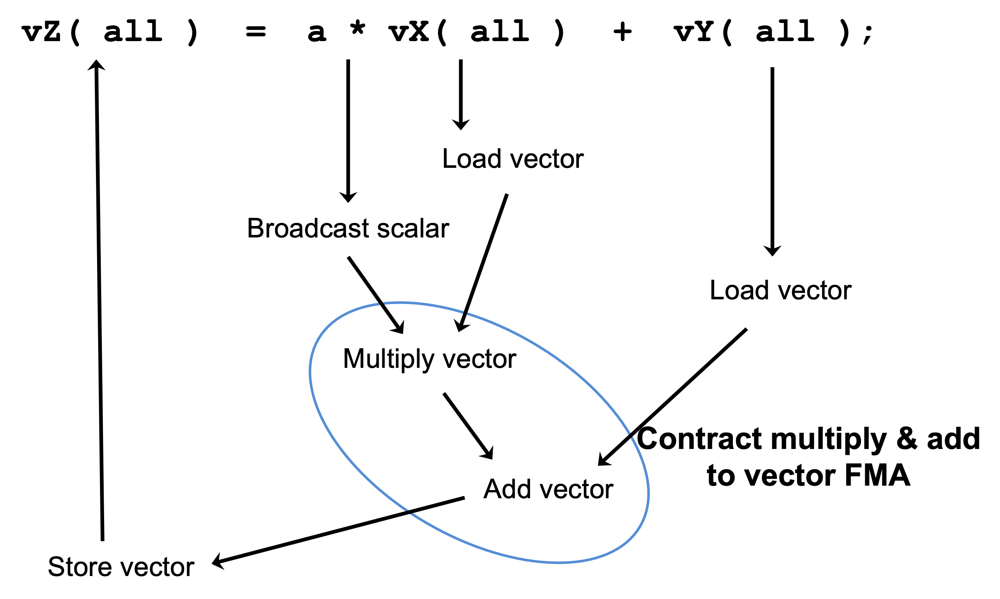

.. ##
.. ## Copyright (c) 2016-22, Lawrence Livermore National Security, LLC
.. ## and other RAJA project contributors. See the RAJA/LICENSE file
.. ## for details.
.. ##
.. ## SPDX-License-Identifier: (BSD-3-Clause)
.. ##

.. _vectorization-label:

==========================
Vectorization (SIMD/SIMT)
==========================

.. warning:: **This section describes an initial draft of an incomplete,
             experimental RAJA capability. It is not considered ready
             for production. A basic description is provided here so
             that (potentially) interested users can take a look, try it 
             out, and provide input if they wish to do so.** 

The RAJA team is experimenting with an API for SIMD/SIMT programming. 
The goal is to make the implementation perform as well as if one used
vectorization intrinsics directly in their code, but without the 
software complexity and maintenance burden associated with doing that. 
In particular, our goal is to *guarantee* that specified vectorization
occurs without needing to explicitly use intrinsics in user code or 
rely on compiler auto-vectorization implementations.

.. note:: All RAJA vectorization types are in the namespace ``RAJA::expt``.

Currently, the main abstractions developed in RAJA so far are:

  * ``Register`` wraps underlying SIMD/SIMT hardware registers and 
    provides consistent uniform access to them, using intrinsics under the
    API when possible. The RAJA register abstraction currently supports the 
    following hardware-specific ISAs : AVX, AVX2, AVX512, CUDA, and HIP.
  * ``Vector`` builds on ``Register`` to provide arbitrary length
    vectors and operations on them.
  * ``Matrix`` builds on ``Register`` to provide arbitrary-sized
    matrices, column-major and row-major layouts, and operations on them.

Finally, these capabilities integrate with RAJA :ref:`feat-view-label` 
capabilities, which implements am expression-template system that allows 
a user to write linear algebra expressions on arbitrarily sized scalars, 
vectors, and matrices and have the appropriate SIMD/SIMT instructions
performed during expression evaluation.

------------------------
Why Are We Doing This?
------------------------

Quoting Tim Foley in `Matt Pharr's blog <https://pharr.org/matt/blog/2018/04/18/ispc-origins>`_: "Auto-vectorization is not a programming model". Unless, of
course, you consider "hope for the best" to be a sound plan.

Auto-vectorization is problematic for multiple reasons. First, vectorization 
is not explicit in the source code and so compilers must divine correctness 
when attempting to apply vectorization optimizations. Since most compilers 
are very conservative in this regard, many vectorization opportunities are 
typically missed when one relies solely on compiler auto-vectorization. 
Second, every compiler will treat your code differently since compiler 
implementations use different heuristics, even for different versions of the 
same compiler. So performance portability is not just an issue with respect to
hardware, but also across compilers. Third, it is impossible in general for 
most application developers to clearly understand the decisions made by a 
compiler during its optimization process. 

Using vectorization intrinsics in application source code is also problematic 
because different processors support different instruction set architectures
(ISAs) and so source code portability requires a mechanism that insulates it 
from architecture-specific code.

GPU programming makes us be explicit about parallelization, and SIMD 
is really no different. RAJA enables single-source portable code across a 
variety of programming model back-ends. The RAJA vectorization abstractions
introduced here are an attempt to bring a level of convergence between SIMD 
and GPU programming by providing uniform access to hardware-specific 
acceleration.

.. note:: **Auto-vectorization is not a programming model.** --Tim Foley

---------------------
Register
---------------------

``RAJA::expt::Register<T, REGISTER_POLICY>`` is a class template that takes a
a data type parameter ``T`` and a register policy ``REGISTER_POLICY`` that
indicates the hardware register type. The ``RAJA::expt::Register`` interface 
provides uniform access to register-level operations. It is intended as a 
building block for higher level abstractions. A ``RAJA::expt::Register`` type 
represents one SIMD register on a CPU architecture and 1 value/SIMT lane on 
a GPU architecture. 

.. note:: A user can use the ``RAJA::expt::Register`` type directly in their
          code. However, we do not recommend this. Instead, we want users to 
          employ higher level abstractions that RAJA provides.

``RAJA::expt::Register`` supports four scalar element types, ``int32_t``, 
``int64_t``, ``float``, and ``double``. These are the only types that are 
portable across all SIMD/SIMT architectures. ``Bfloat``, for example, is not 
portable, so we don't provide support for that type.

``RAJA::expt::Register`` supports the following SIMD/SIMT hardware-specific 
ISAs: AVX, AVX2, and AVX512 for SIMD CPU vectorization, and CUDA warp,
HIP wavefront for GPUs. Scalar support is provided for all hardware for
portability and experimentation/analysis. Extensions to support other 
architectures may be forthcoming and should be straightforward to implement.

Register Operations
^^^^^^^^^^^^^^^^^^^^^^^^^^^^^^^^^^^^

``RAJA::expt::Register`` provides various operations, including:

  * Basic SIMD handling: get element, broadcast
  * Memory operations: load (packed, strided, gather) and store (packed, strided, scatter)
  * SIMD element-wise arithmetic: add, subtract, multiply, divide, vmin, vmax
  * Reductions: dot-product, sum, min, max
  * Special operations for matrix operations: permutations, segmented operations

.. note: All operations are provided for all hardware. Depending on hardware
         support, some operations may have slower serial performance; 
         e.g., gather/scatter.

Register DAXPY Example
^^^^^^^^^^^^^^^^^^^^^^^^^^^^^^^^^

The following is a code example that shows using the ``RAJA::expt::Register`` 
class to perform a DAXPY kernel with AVX2 CPU SIMD instructions.
Again, we do not recommend that you write code directly using the Register
class, but use the higher level VectorRegister abstraction.  
However, this example demonstrates how the higher level abstractions are
using the Register class::

  // define array length
  int len = ...;

  // data used in kernel
  double a = ...;
  double const *X = ...; 
  double const *Y = ...; 
  double *Z = ...; 

  using reg_t = RAJA::expt::Register<double, RAJA::expt::avx2_register>;
  int reg_width = reg_t::s_num_elem;    // width of avx2 register is 4 doubles	

  // Compute daxpy in chunks of 4 values at one time
  for (int i = 0;i < len; i += reg_width){
    reg_t x, y;
    
    // load 4 consecutive values of X, Y arrays into registers
    x.load_packed( X+i );
    y.load_packed( Y+i );

    // perform daxpy on 4 values simultaneously (store in register)
    reg_t z = a * x + y;

    // store register result in Z array
    z.store_packed( Z+i );
  }

  // loop postamble code
  int remainder = len % reg_width;
  if (remainder) {
    reg_t x, y;

    // 'i' is the starting array index of the remainder
    int i = len - remainder;
       
    // load remainder values of X, Y arrays into registers 
    x.load_packed_n( X+i, remainder );
    y.load_packed_n( Y+i, remainder );

    // perform daxpy on remainder values simultaneously (store in register)
    reg_t z = a * x + y;

    // store register result in Z array
    z.store_packed_n(Z+i, remainder);
  }

This code is guaranteed to vectorize since the ``RAJA::expt::Register`` 
operations insert the appropriate SIMD intrinsic operations into the method 
calls. Note that ``RAJA::expt::Register`` provides overloads of basic 
arithmetic operations so that the DAXPY operation itself (z = a * x + y) looks 
like vanilla scalar code.

Note that since we are using bare pointers to the data, load and store 
operations are performed by explicit method calls in the code. Also, we must
write (duplicate) postamble code to handle cases where the array length 
(len) is not an integer multiple of the register width. The postamble code 
perform the DAXPY operation on the *remainder* of the array that remains after 
the for-loop.

**These extra lines of code should make it clear why we do not recommend
using ``RAJA::Register`` directly in application code.**

-------------------
Tensor Register
-------------------

``RAJA::expt::TensorRegister< >`` is a class template that provides a 
higher-level interface on top of the ``RAJA::expt::Register`` class.  
``RAJA::expt::TensorRegister< >`` wraps one or more 
``RAJA::expt::Register< >`` objects to create a tensor-like object.

.. note:: As with ``RAJA::expt::Register``, we don't recommend using 
          ``RAJA::expt::TensorRegister`` directly. Rather, we recommend using
          use-case specific types that RAJA provides and which are described 
          below.

**To make code cleaner and more readable, the specific types are intended to
be used with ``RAJA::View`` and ``RAJA::expt::TensorIndex`` objects.**

Vector Register
^^^^^^^^^^^^^^^^^^^^^^^^^^^^^^^

``RAJA::expt::VectorRegister<T, REGISTER_POLICY, NUM_ELEM>`` provides an 
abstraction for a vector of arbitrary length. It is implemented using one or 
more ``RAJA::expt::Register`` objects. The vector length is independent of the 
underlying register width. The template parameters are: ``T`` data type, 
``REGISTER_POLICY`` vector register policy, and ``NUM_ELEM`` number of 
data elements of type ``T`` that fit in a register. The last two of these
have defaults for all cases, so they do not usually need to be provided by
a user.

Earlier, we said that we do not recommended using ``RAJA::expt::Register``
directly. The reason for this is that it is good to decouple
vector length from hardware register size since it allows one to write
simpler, more readable code that is easier to get correct. This should be 
clear from the code example below.

Vector Register DAXPY Example
^^^^^^^^^^^^^^^^^^^^^^^^^^^^^^^^^^^^^^^

The following code example shows the DAXPY computation shown above written 
using ``RAJA::expt::VectorRegister``, ``RAJA::expt::VectorIndex``, and 
``RAJA::View`` classes, which obviate the need for the extra lines of code 
discussed earlier::

  // define array length and data used in kernel (as before)
  int len = ...;
  double a = ...;
  double const *X = ...;
  double const *Y = ...;
  double *Z = ...;

  // define vector register and index types
  using vec_t = RAJA::expt::VectorRegister<double, RAJA::expt::avx2_register>;
  using idx_t = RAJA::expt::VectorIndex<int, vec_t>;

  // wrap array pointers in RAJA View objects   
  auto vX = RAJA::make_view( X, len );
  auto vY = RAJA::make_view( Y, len );
  auto vZ = RAJA::make_view( Z, len );

  // 'all' knows the length of vX, vY, and vZ from the View objects
  // and it encodes the vector type
  auto all = idx_t::all();

  // compute the complete array daxpy in one line of code
  // this produces a vectorized loop, and the loop postamble
  vZ( all ) = a * vX( all ) + vY( all );

This code has several advantages over the previous example. It is guaranteed 
to vectorize and is much easier to read, get correct, and maintain since 
the ``RAJA::View`` class handles the looping and postamble code automatically 
to allow arrays of arbitrary size. The ``RAJA::View`` class provides overloads 
of the arithmetic operations based on the 'all' type and inserts the 
appropriate SIMD instructions and load/store operations to vectorize the 
operations as in the earlier example. It may be considered by some to be 
inconvenient to have to use the ``RAJA::View`` class, but it is easy to wrap 
bare pointers as can is shown in the example.

Expression Templates
^^^^^^^^^^^^^^^^^^^^^^^^

The figure below shows the sequence of SIMD operations, in the form of an
*abstract syntax tree (AST)*, applied in the DAXPY code by the RAJA constructs 
used in the code example. During compilation, a tree of *expression template*
objects is constructed based on the order of operations that appear in the 
kernel. Specifically, the operation sequence is the following:

  #. Load a chunk of values in 'vX' into a register.
  #. Broadcast the scalar value 'a' to each slot in a vector register.
  #. Load a chunk of values in 'vY' into a register.
  #. Multiply values in the 'a' register and 'vX' register and multiply
     by the values in the 'vY' register in a single vector FMA
     (Fused Multiply-Add) operation, storing the result in a register.
  #. Write the result in the register to the 'vZ' array.

``RAJA::View`` objects indexed by ``RAJA::TensorIndex`` objects 
(``RAJA::VectorIndex`` in this case) return *LoadStore* expression
template objects. Each expression template object is evaluated on assignment 
and a register chunk size of values is loaded into another register object.
Finally, the left-hand side of the expression is evaluated by storing the
chunk of values in the right-hand side result register into the array on the
left-hand side of the equal sign.

   An AST illustration of the SIMD operations in the DAXPY code.

CPU/GPU Portability
^^^^^^^^^^^^^^^^^^^^^

It is important to note that the code in the example in the previous section is 
*not* portable to run on a GPU because it does not include a way to launch a 
GPU kernel. The following code example shows how to enable the code to run on 
either a CPU or GPU via a run time choice::

  // array lengths and data used in kernel same as above

  // define vector register and index types
  using vec_t = RAJA::expt::VectorRegister<double>;
  using idx_t = RAJA::expt::VectorIndex<int, vec_t>;

  // array pointers wrapped in RAJA View objects as before
  // ...

  using cpu_launch = RAJA::expt::seq_launch_t;
  using gpu_launch = RAJA::expt::cuda_launch_t<false>; // false => launch
                                                       // CUDA kernel
                                                       // synchronously

  using pol_t = 
    RAJA::expt::LoopPolicy< cpu_launch, gpu_launch >;

  RAJA::expt::ExecPlace cpu_or_gpu = ...;

  RAJA::expt::launch<pol_t>( cpu_or_gpu, resources,

                             [=] RAJA_HOST_DEVICE (context ctx) {
                                 auto all = idx_t::all();
                                 vZ( all ) = a * vX( all ) + vY( all );
                             }
                           );

This version of the kernel can be run on a CPU or GPU depending on the run time
chosen value of the variable ``cpu_or_gpu``. When compiled, the code will 
generate versions of the kernel for the CPU and GPU based on the parameters 
in the ``pol_t`` loop policy. The CPU version will be the same as the version
in the previous section. The GPU version is essentially the same but will
run in a GPU kernel. Note that there is only one template argument passed to 
the register when ``vec_t`` is defined. ``RAJA::expt::VectorRegister<double>``
uses defaults for the register policy, based on the system hardware, and 
number of data elements of type double that will fit in a register.

Matrix Registers
^^^^^^^^^^^^^^^^^^^^^^^^^^^^^^

RAJA provides ``RAJA::expt::TensorRegister`` type aliases to support
matrices of arbitrary size and shape. These are:

  * ``RAJA::expt::SquaretMatrixRegister<T, LAYOUT, REGISTER_POLICY>`` which
    abstracts operations on an N x N square matrix.
  * ``RAJA::expt::RectMatrixRegister<T, LAYOUT, ROWS, COLS, REGISTER_POLICY>`` 
     which abstracts operations on an N x M rectangular matrix.

Matrices are implemented using one or more ``RAJA::expt::Register`` 
objects. Data layout can be row-major or column major. Matrices are intended 
to be used with ``RAJA::View`` and ``RAJA::expt::TensorIndex`` objects,
similar to what was shown above with ``RAJA::expt::VectorRegister`` example.

Matrix operations support matrix-matrix, matrix-vector, and vector-matrix 
multiplication, and transpose operations. Rows or columns can be represented
with one or more registers, or a power-of-two fraction of a single register.
This is important for CUDA GPU warp/wavefront registers, which are 32-wide for
CUDA and 64-wide for HIP.

Here is a simple code example that performs the matrix-analogue of the 
vector DAXPY operation presented above using square matrices::

  // define matrix size and data used in kernel (similar to before)
  int N = ...;
  double a = ...;
  double const *X = ...;
  double const *Y = ...;
  double *Z = ...;

  // define matrix register and row/column index types
  using mat_t = RAJA::expt::SquareMatrixRegister<double, 
                                                 RAJA::expt::RowMajorLayout>;
  using row_t = RAJA::expt::RowIndex<int, mat_t>;
  using col_t = RAJA::expt::ColIndex<int, mat_t>;

  // wrap array pointers in RAJA View objects (similar to before)
  auto mX = RAJA::make_view( X, N, N );
  auto mY = RAJA::make_view( Y, N, N );
  auto mZ = RAJA::make_view( Z, N, N );

  using cpu_launch = RAJA::expt::seq_launch_t;
  using gpu_launch = RAJA::expt::cuda_launch_t<false>; // false => launch
                                                       // CUDA kernel
                                                       // synchronously
  using pol_t =
    RAJA::expt::LoopPolicy< cpu_launch, gpu_launch >;

  RAJA::expt::ExecPlace cpu_or_gpu = ...;

  RAJA::expt::launch<pol_t>( cpu_or_gpu, resources,

      [=] RAJA_HOST_DEVICE (context ctx) {
         auto rows = row_t::all();
         auto cols = col_t::all();
         mZ( rows, cols ) = a * mX( rows, cols ) + mY( rows, cols );
      }
    ); 

Conceptually, as well as implementation-wise, this is similar to the previous
vector example except the operations are in two dimensions. The kernel code is 
easy to read, it is guaranteed to vectorize, and iterating over the data is 
handled by RAJA (register width sized chunk, plus postamble scalar operations).
Again, the ``RAJA::View`` arithmetic operation overloads insert the 
appropriate vector instructions in the code.

