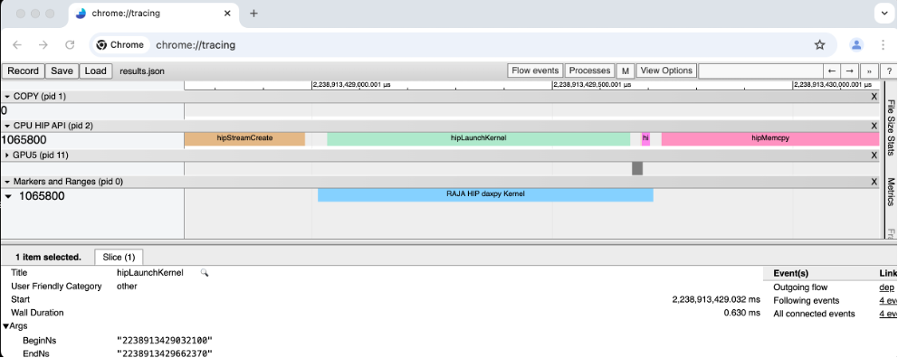
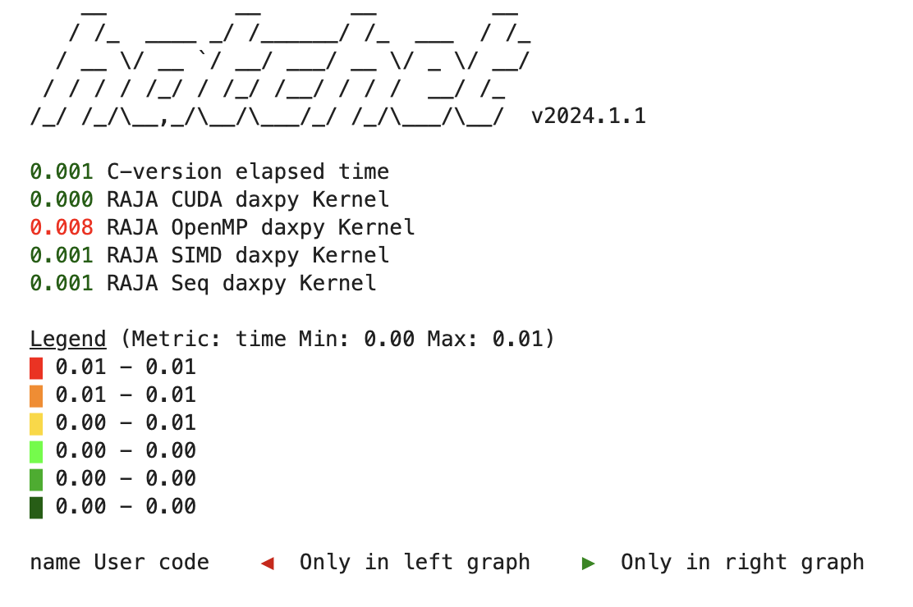

.. ##
.. ## Copyright (c) 2016-25, Lawrence Livermore National Security, LLC
.. ## and RAJA project contributors. See the RAJA/LICENSE file
.. ## for details.
.. ##
.. ## SPDX-License-Identifier: (BSD-3-Clause)
.. ##

.. _profiling-with-Caliper-label:

************************
Profiling with Caliper
************************

The RAJA abstraction layer has dynamic and static plugin support for the Caliper performance library.
We refer the reader to the :ref:`feat-plugins-label` section for more on RAJA plugins. Caliper is developed at LLNL and freely available on GitHub,
see `Caliper GitHub <https://github.com/LLNL/Caliper>`_ . Caliper provides a common interface for various vendor profiling tools and its own built-in performance
reports.

In this section we demonstrate how to configure RAJA with Caliper, run simple examples with kernel profiling,
and view a quick snapshot of hotspots of using the Thicket libary. The Thicket library is also developed at LLNL and freely available on GitHub,
see `Thicket GitHub <https://github.com/LLNL/Thicket>`_ .
This page is tailored to be a quickstart guide, for more detailed tutorials we refer the reader to the Caliper and Thicket tutorials which are accessible on the GitHub pages for those projects.

=================================
Building and running with Caliper
=================================

Caliper serves as a portable profiling library which may be configured with various vendor options. For the most up to date
configuration options we refer the reader to the `Caliper GitHub <https://github.com/LLNL/Caliper>`_  page.
For the following examples we use Caliper v2.12.1 and configure on three different platforms; CPU only, with NVTX for CUDA, and with ROCTX for HIP::

  //Basic CPU using default build parameters
  cmake ../

  //With NVTX ON
  cmake -DWITH_NVTX=ON ../

  //With ROCTX ON
  cmake -DWITH_ROCTX=ON ../

Building RAJA with Caliper enabled requires pointing RAJA to the Caliper shared cmake file and enabling plugins::

  cmake -DRAJA_ENABLE_RUNTIME_PLUGINS=ON -DRAJA_ENABLE_CALIPER=ON -Dcaliper_DIR=${CALIPER_BUILD_DIR}/share/cmake/caliper ../

As a quick build check we build the basic Caliper RAJA-Caliper example::

  make raja-forall-caliper

Finally, the Caliper annotated RAJA example may be executed via::

  CALI_CONFIG=runtime-report ./bin/raja-forall-caliper

If we build with NVTX enabled Caliper and CUDA enabled RAJA, the program should output
the following runtime information::

  Path                     Time (E) Time (I) Time % (E) Time % (I)
  C-version elapsed time   0.000820 0.000820   0.395169   0.395169
  RAJA Seq daxpy Kernel    0.000655 0.000655   0.315502   0.315502
  RAJA SIMD daxpy Kernel   0.000611 0.000611   0.294629   0.294629
  RAJA OpenMP daxpy Kernel 0.013691 0.013691   6.598422   6.598422
  RAJA CUDA daxpy Kernel   0.000118 0.000118   0.056827   0.056827

The (E) column corresponds to exclusive timing; while the (I) column will correspond to inclusive timing.
The left two columns are absolute time in seconds while the right two columns correspond to percentage of time
within the program.

.. note:: RAJA methods which offload to the GPU will require a synchronous GPU policy to ensure that the kernel
          has completed prior to the total runtime being reported. For asynchronous kernels Caliper offers the
          `hip.gputime` or `cuda.gputime` service which may be added to CALI_CONFIG to accurately capture kernel
          time.

========================================
Profiling RAJA kernels via kernel naming
========================================

Caliper annotations of RAJA kernels work through the RAJA kernel naming mechanism which is currently only supported in forall
and launch. The ``RAJA::Name`` container holds a string and is used for profiling in Caliper.::

    RAJA::forall<RAJA::seq_exec>(RAJA::RangeSegment(0, N),
    RAJA::Name("RAJA Seq daxpy Kernel"), [=] (int i) {

        a[i] += b[i] * c;

  });

Kernels which are not provided a name are ommited from Caliper profiling.

.. note:: The RAJA Name feature lives under the RAJA namespace.

.. note:: The RAJA Name may be placed anywhere in the RAJA reducer parameter list.

.. note:: When RAJA is not configured with Caliper, NVTX and ROCTX profiling can
          still be configured with RAJA using the following CMAKE variables respectively::

            -DRAJA_ENABLE_NVTX=ON
            -DRAJA_ENABLE_ROCTX=ON

.. note:: When Caliper is configured with RAJA all performance profiling is performed by Caliper.

=============================================
Basic integration with vendor profiling tools
=============================================

Once RAJA is configured with Caliper and kernels are provided with kernel names, the Caliper library provides various
services to understand code performence. For example the following command::

  CALI_CONFIG=cuda-activity-report,show_kernels ./bin/raja-forall-caliper

will report all CUDA related activity within an exectuable::

  Path                     Kernel                                           Host Time GPU Time GPU %
  C-version elapsed time                                                     0.000744
  RAJA Seq daxpy Kernel                                                      0.000783
  RAJA SIMD daxpy Kernel                                                     0.000704
  RAJA OpenMP daxpy Kernel                                                   0.009124
  cudaMalloc                                                                 0.128423
  cudaMemcpy                                                                 0.002385 0.001757 73.662910
  cudaStreamCreate                                                           0.000230
  RAJA CUDA daxpy Kernel
  |-                                                                         0.000159
  |-                      void RAJA::policy::cuda~~}::detail::Name>)            0.000038
  cudaLaunchKernel
   |-                                                                        0.000066
   |-                    void RAJA::policy::cuda~~}::detail::Name>)            0.000038
  cudaStreamSynchronize                                                      0.000050
  cudaFree                                                                   0.000495

A simiar command may be found for HIP kernels under the Caliper documentation.

^^^^^^^^^^^^^^^^^^^^^^^^^^^^^^^^^^^^^^^^
Generating an NVIDIA Nsight Systems file
^^^^^^^^^^^^^^^^^^^^^^^^^^^^^^^^^^^^^^^^

Caliper can also be used to generate a NVIDIA Nsight Systems file. The following command will generate the file and annotate the CUDA
kernel region::

  CALI_SERVICES_ENABLE=nvtx,cuda nsys profile -o my_profile ./bin/raja-forall-caliper

The nsys file may then be read into the NVIDIA Nsight toolkit.

^^^^^^^^^^^^^^^^^^^^^^^^^^^^
Generating a ROCM trace file
^^^^^^^^^^^^^^^^^^^^^^^^^^^^

Configuring a ROCM trace file with Caliper may be done using the following command::

  CALI_SERVICES_ENABLE=roctx,rocm,trace rocprof --hip-trace --roctx-trace ./bin/raja-forall-caliper

The trace file may then be read into the Chrome tracer tool as demonstrated below.

^^^^^^^^^^^^^^^^^^^^^^^
Generating Hatchet file
^^^^^^^^^^^^^^^^^^^^^^^

Lastly, the following command will generate a .cali file which can be read into the Thicket library::

  CALI_CONFIG=hatchet-region-profile ./bin/raja-forall-caliper

Using python jupyter notebooks and the Hatchet library we can load the .cali file and begin analyzing
performance of our application. The following sequence of commands will generate a color coded tree
high-lighting hotspots (in red) of our application::

  caliper_file = region_profile.cali
  gf = ht.GraphFrame.from_caliperreader(caliper_file)
  print(gf.tree())

Within the jupyter notebook the color coded tree will look like this:

=============
Final remarks
=============

The capabilities of Caliper and Hatchet exceed what has been presented here. Our main goal was to provide
users a quick start guide to building and profiling with Caliper and Hatchet. We highly recommend exploring
the `Caliper GitHub <https://github.com/LLNL/Caliper>`_  and `Thicket GitHub <https://github.com/LLNL/Thicket>`_
pages for the latest versions and links to documentation. Finally, a full-fledged tutorial is avaible of LLNL profiling
tools on YouTube `2024 Caliper, Hatchet, and Thicket <https://youtu.be/qVmxDOxM9Ws?feature=shared>`_.
