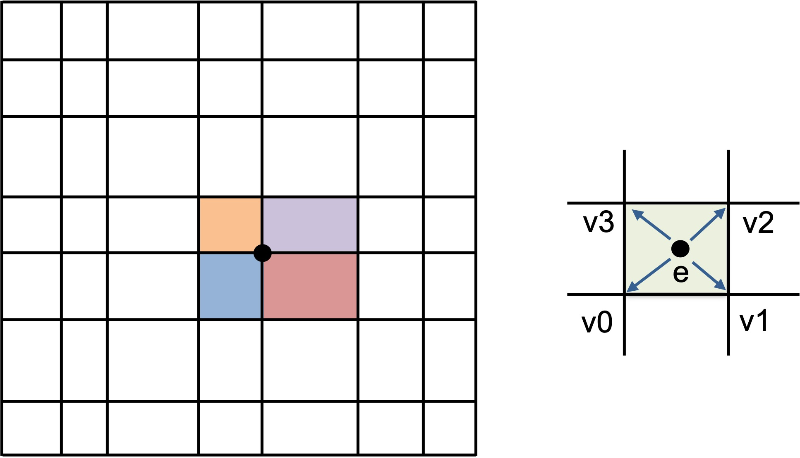

.. ##
.. ## Copyright (c) 2016-22, Lawrence Livermore National Security, LLC
.. ## and RAJA project contributors. See the RAJA/LICENSE file
.. ## for details.
.. ##
.. ## SPDX-License-Identifier: (BSD-3-Clause)
.. ##

.. _vertexsum-label:

--------------------------------------------------
Mesh Vertex Sum Example: Iteration Space Coloring
--------------------------------------------------

This section contains an exercise file ``RAJA/exercises/vertexsum-indexset.cpp``
for you to work through if you wish to get some practice with RAJA. The
file ``RAJA/exercises/vertexsum-indexset_solution.cpp`` contains complete
working code for the examples discussed in this section. You can use the
solution file to check your work and for guidance if you get stuck. To build
the exercises execute ``make vertexsum-indexset`` and ``make vertexsum-indexset_solution``
from the build directory.

Key RAJA features shown in this example are:

  * ``RAJA::forall`` loop execution template method
  * ``RAJA::TypedListSegment`` iteration space construct
  * ``RAJA::TypedIndexSet`` iteration space segment container and 
    associated execution policies

The example computes a sum at each vertex on a logically-Cartesian 2D mesh
as shown in the figure.

   The "area" of each vertex is the sum of an area contribution from each element sharing the vertex (left). In particular, one quarter of the area of each mesh element is summed to the vertices surrounding the element (right).

Each sum is an average of the area of the four mesh elements that share the 
vertex. In many "staggered mesh" applications, an operation like this is common 
and is often written in a way that presents the algorithm clearly but prevents 
parallelization due to potential data races. That is, multiple loop iterates 
over mesh elements may attempt to write to the same shared vertex memory 
location at the same time. The example shows how RAJA constructs can be 
used to enable one to express such an algorithm in parallel and have it
run correctly without fundamentally changing how it looks in source code.

We start by setting the size of the mesh, specifically, the total number of 
elements and vertices and the number of elements and vertices in each direction:

.. literalinclude:: ../../../../exercises/vertexsum-indexset_solution.cpp
   :start-after: _vertexsum_define_start
   :end-before: _vertexsum_define_end
   :language: C++

We also set up an array to map each element to its four surrounding vertices
and set the area of each element:

.. literalinclude:: ../../../../exercises/vertexsum-indexset_solution.cpp
   :start-after: _vertexsum_elemarea_start
   :end-before: _vertexsum_elemarea_end
   :language: C++

Then, a sequential C-style version of the vertex area calculation looks like 
this:

.. literalinclude:: ../../../../exercises/vertexsum-indexset_solution.cpp
   :start-after: _cstyle_vertexarea_seq_start
   :end-before: _cstyle_vertexarea_seq_end
   :language: C++

We can't parallelize the entire computation at once due to potential race
conditions where multiple threads may attempt to sum to a shared element 
vertex simultaneously. However, we can parallelize the computation in 
parts. Here is a C-style OpenMP parallel implementation:

.. literalinclude:: ../../../../exercises/vertexsum-indexset_solution.cpp
   :start-after: _cstyle_vertexarea_omp_start
   :end-before: _cstyle_vertexarea_omp_end
   :language: C++

What we've done is broken up the computation into four parts, each of which
can safely run in parallel because there are no overlapping writes to the
same entry in the vertex area array in each parallel section. Note that there 
is an outer loop on length four, one iteration for each of the elements that 
share a vertex. Inside the loop, we iterate over a subset of elements in 
parallel using an indexing area that guarantees that we will have no
data races. In other words, we have "colored" the elements as shown in the
figure below. 

   We partition the mesh elements into four disjoint subsets shown by the colors and numbers so that within each subset no two elements share a vertex.

For completeness, the computation of the four element indexing arrays is:

.. literalinclude:: ../../../../exercises/vertexsum-indexset_solution.cpp
   :start-after: _vertexarea_color_start
   :end-before: _vertexarea_color_end
   :language: C++

^^^^^^^^^^^^^^^^^^^^^^^
RAJA Parallel Variants
^^^^^^^^^^^^^^^^^^^^^^^

To implement the vertex sum calculation using RAJA, we employ 
``RAJA::TypedListSegment`` iteration space objects to enumerate the mesh
elements for each color and put them in a ``RAJA::TypedIndexSet`` object.
This allows us to execute the entire calculation using one ``RAJA::forall``
call. 

We declare a type alias for the list segments to make the code more compact:

.. literalinclude:: ../../../../exercises/vertexsum-indexset_solution.cpp
   :start-after: _vertexarea_listsegtype_start
   :end-before: _vertexarea_listsegtype_end
   :language: C++

Then, we build the index set:

.. literalinclude:: ../../../../exercises/vertexsum-indexset_solution.cpp
   :start-after: _vertexarea_indexset_start
   :end-before: _vertexarea_indexset_end
   :language: C++

Note that we construct the list segments using the arrays we made earlier 
to partition the elements. Then, we push them onto the index set.

Now, we can use a two-level index set execution policy that iterates over the 
segments sequentially and executes each segment in parallel using OpenMP
multithreading to run the kernel:

.. literalinclude:: ../../../../exercises/vertexsum-indexset_solution.cpp
   :start-after: _raja_vertexarea_omp_start
   :end-before: _raja_vertexarea_omp_end
   :language: C++

The execution of the RAJA version is similar to the C-style OpenMP variant 
shown earlier, where we executed four OpenMP parallel loops in sequence, 
but the code is more concise. In particular, we execute four parallel OpenMP
loops, one for each list segment in the index set. Also, note that we do
not have to manually extract the element index from the segments like we
did earlier since RAJA passes the segment entries directly to the lambda
expression.

Here is the RAJA variant where we iterate over the 
segments sequentially, and execute each segment in parallel via a CUDA
kernel launched on a GPU:

.. literalinclude:: ../../../../exercises/vertexsum-indexset_solution.cpp
   :start-after: _raja_vertexarea_cuda_start
   :end-before: _raja_vertexarea_cuda_end
   :language: C++

The only differences here are that we have marked the lambda loop body with the 
``RAJA_DEVICE`` macro, used a CUDA segment execution policy, and built a new 
index set with list segments created using a CUDA resource so that the indices 
live in device memory.

The RAJA HIP variant, which we show for completeness, is similar:

.. literalinclude:: ../../../../exercises/vertexsum-indexset_solution.cpp
   :start-after: _raja_vertexarea_hip_start
   :end-before: _raja_vertexarea_hip_end
   :language: C++

The main difference for the HIP variant is that we use explicit device
memory allocation/deallocation and host-device memory copy operations.

